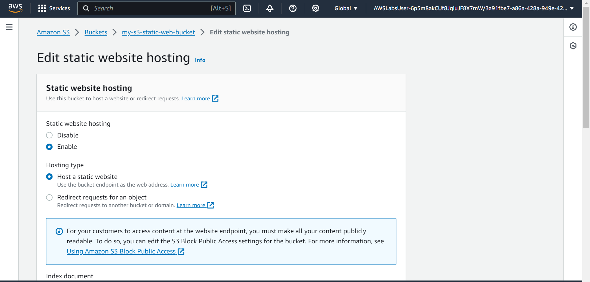
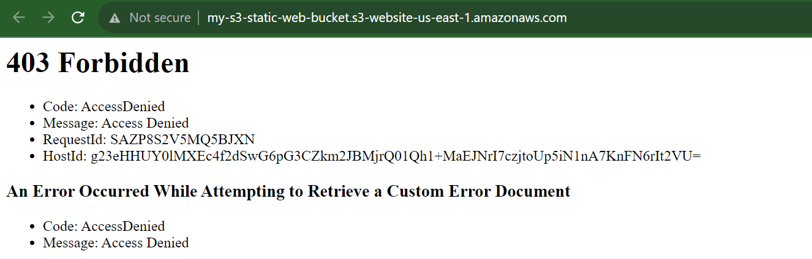
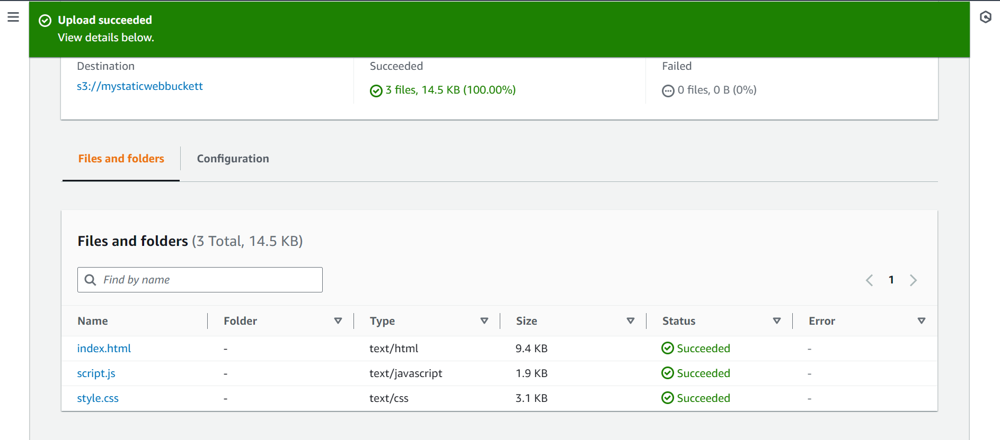
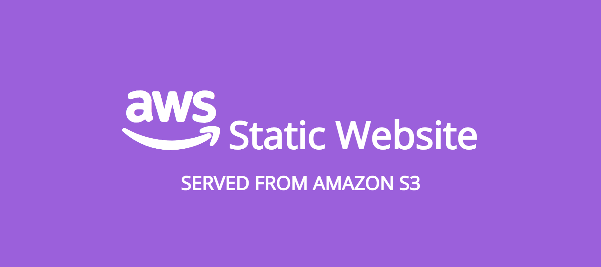
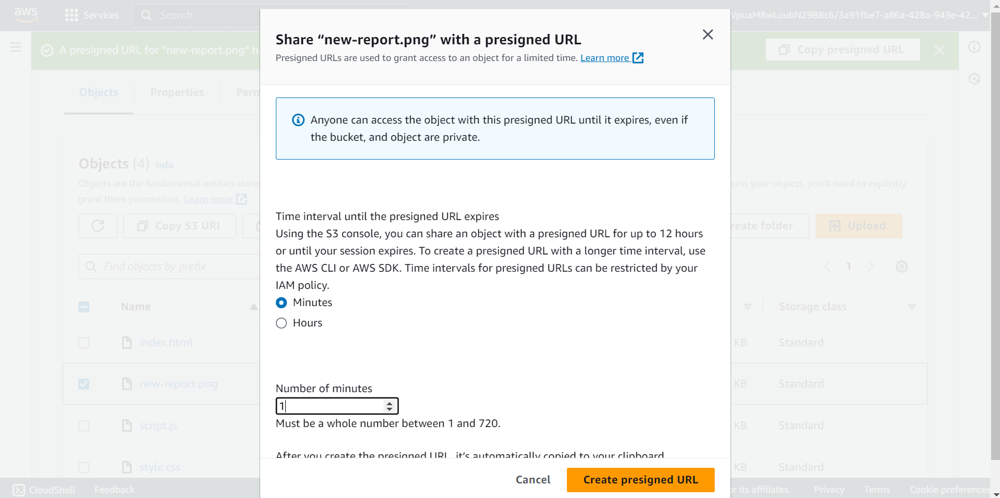
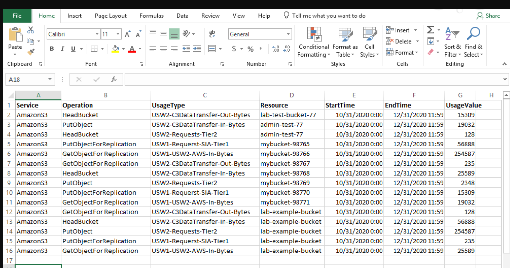
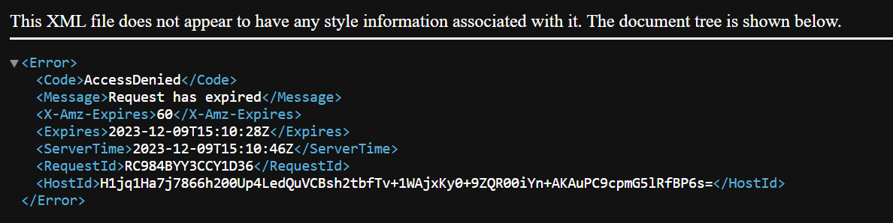

## OBJECTIVES

Create a bucket in Amazon S3.\
Configure a bucket to host a static website.\
Upload content to a bucket.\
Turned on public access to bucket objects.\
Securely share a bucket object using a presigned URL.\
Secure a bucket using a bucket policy.\
Update the website.\
View object versions in the Amazon S3 console.
___


```
my-s3-static-web-bucket
```
___

## Configuring S3 bucket for static web hosting


```
index.html
error.htmsl
```
___

error 403 Forbidden message recieved because   bucket permissions has not yet been configured. This indicates that the object has been uploaded to amazon s3 but the status of the content of the bucket is private.
You can make Amazon S3 objects public through two different ways:

To make either a whole bucket public or a specific directory in a bucket public, use a bucket policy.

To make individual objects in a bucket public, use an access control list (ACL). It is normally safer to make individual objects public because doing so avoids accidentally making other objects public. However, if you know that the entire bucket contains no sensitive information, you can use a bucket policy.


-

Object successfully uploadedin bucket


```
index.html
script.js
style.css
```
___

Objects in bucket made public using ACL (Access Control List)


___

After making objects bucket publicly accesible, you should now see the static website that is being hosted by Amazon S3.


# - Task 5: Securely sharing an object using a presigned URL

When you need to temporarily and securely share an object with a person or group of people, you can create a presigned URL Presigned URL helps us to securely and temporarily share files (objects in s3 bucket) with a person or group.
When you create the URL, you must configure how long the URL will be valid. Then, you can share this URL with the users who should have access to the object.

 As long as the presigned URL is valid, anyone who has it can get acces to the object in your bucket. It is a best practice reccomendation to avoid keeping the URL active longer than necessary, and only share the URL with concerned persons.

 Instead of making the newsreport object in the s3 bucket public, a presigned URL to access the file. the time interval until the presigened url expires was set to 1 minute. 




presigend url expires after 1 minute
