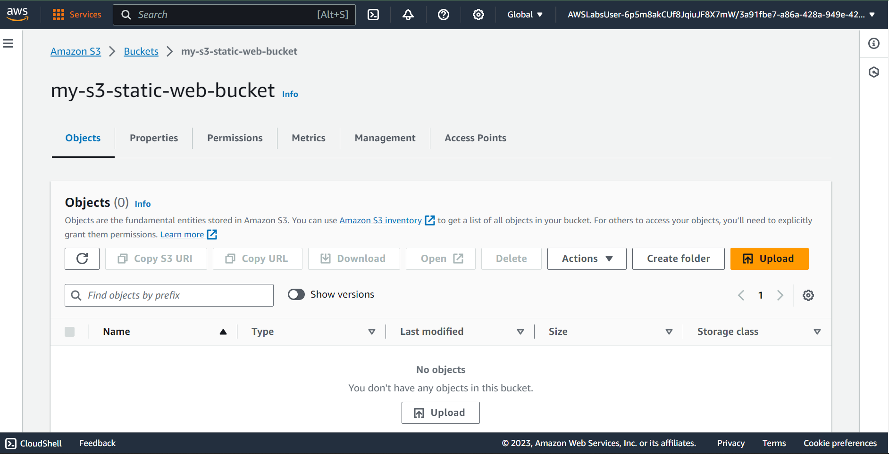

## OBJECTIVES

Create a bucket in Amazon S3.\
Configure a bucket to host a static website.\
Upload content to a bucket.\
Turned on public access to bucket objects.\
Securely share a bucket object using a presigned URL.\
Secure a bucket using a bucket policy.\
Update the website.\
View object versions in the Amazon S3 console.
___


```
my-s3-static-web-bucket
```
___
